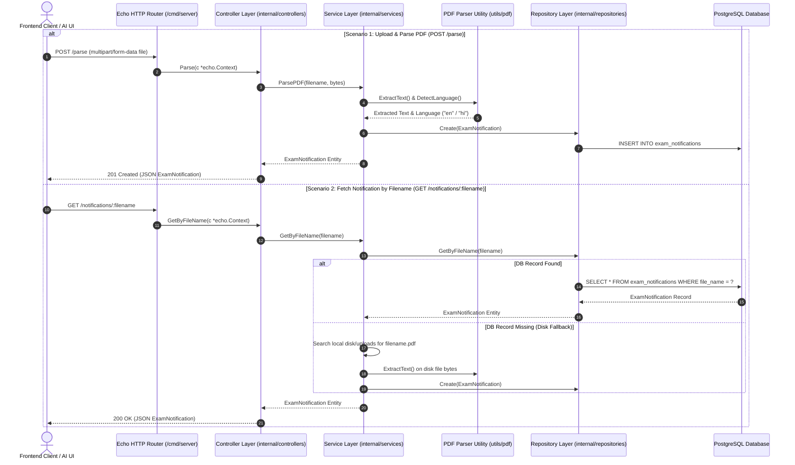

# PDF Parser Service - API Documentation & Integration Guide

Comprehensive API reference and architecture documentation for frontend engineers and AI code assistants building user interfaces (React, Angular, Vue, Next.js) for the **PDF Parser Service**.

---

## 🏛️ System Architecture Overview

The **PDF Parser Service** is a high-performance Go microservice built on Echo v5 and GORM. It extracts plain text from official exam notification PDF documents, auto-detects document language (English / Hindi), and persists parsed records to PostgreSQL.



---

## 🌐 Base URL & Conventions

- **Local Base URL**: `http://localhost:8080`
- **Content-Type**: `application/json` (except `POST /parse` which uses `multipart/form-data`)
- **Date/Time Format**: ISO 8601 UTC string (`YYYY-MM-DDTHH:mm:ssZ`)

---

## 🛠️ TypeScript Interfaces (For Frontend & AI Component Generation)

Frontend developers and AI UI generators can copy these TypeScript interfaces to type API requests, responses, and state management cleanly:

```typescript
/**
 * Exam Notification entity returned by /parse and /notifications/:filename
 */
export interface ExamNotification {
  id: number;
  file_name: string;
  raw_text: string;
  language: 'en' | 'hi' | string;
}

/**
 * Standardized Error Response Envelope
 */
export interface ApiErrorEnvelope {
  success: false;
  error: {
    code: ApiErrorCode;
    message: string;
    timestamp: string;
    path: string;
    details?: Record<string, unknown> | null;
    internal_error?: string;
  };
}

/**
 * Standard API Error Codes
 */
export type ApiErrorCode =
  | 'ERR_BAD_REQUEST'
  | 'ERR_NOT_FOUND'
  | 'ERR_UNPROCESSABLE_ENTITY'
  | 'ERR_UNSUPPORTED_LANGUAGE'
  | 'ERR_INTERNAL_SERVER_ERROR'
  | 'ERR_VALIDATION_ERROR'
  | 'ERR_UNAUTHORIZED'
  | 'ERR_FORBIDDEN';

/**
 * Health Check Response Payload
 */
export interface HealthCheckResponse {
  status: 'healthy' | 'unhealthy';
}
```

---

## 🔌 API Endpoints Reference

### 1. Upload & Parse Exam Notification PDF

Extracts plain text and language metadata from an uploaded binary PDF document, saves the entity in PostgreSQL, and returns the parsed payload.

- **HTTP Method**: `POST`
- **Endpoint Path**: `/parse`
- **Request Headers**:
  - `Content-Type`: `multipart/form-data`
- **Request Body**:
  - `file` (*required*, Binary PDF file): The PDF file to upload and parse.

#### Success Response (`201 Created`)

```json
{
  "id": 1,
  "file_name": "upsc_civil_services_2026.pdf",
  "raw_text": "UNION PUBLIC SERVICE COMMISSION\nEXAMINATION NOTICE NO. 05/2026-CSP\nLAST DATE FOR SUBMISSION OF APPLICATIONS: 05/03/2026\n...",
  "language": "en"
}
```

#### Error Responses

- **400 Bad Request** (Missing form file field or empty file upload):
  ```json
  {
    "success": false,
    "error": {
      "code": "ERR_BAD_REQUEST",
      "message": "Missing 'file' field in multipart form",
      "timestamp": "2026-08-20T16:50:00Z",
      "path": "/parse"
    }
  }
  ```

- **422 Unprocessable Entity** (Corrupted PDF or Unsupported Language):
  ```json
  {
    "success": false,
    "error": {
      "code": "ERR_UNSUPPORTED_LANGUAGE",
      "message": "Unsupported document language. Only English and Hindi PDFs are supported",
      "timestamp": "2026-08-20T16:50:00Z",
      "path": "/parse"
    }
  }
  ```

#### Integration Code Examples

<details>
<summary><strong>cURL</strong></summary>

```bash
curl -X POST http://localhost:8080/parse \
  -F "file=@/path/to/notification.pdf"
```
</details>

<details>
<summary><strong>JavaScript / TypeScript (Fetch API)</strong></summary>

```typescript
async function parsePdfFile(file: File): Promise<ExamNotification> {
  const formData = new FormData();
  formData.append('file', file);

  const response = await fetch('http://localhost:8080/parse', {
    method: 'POST',
    body: formData,
  });

  if (!response.ok) {
    const errorData: ApiErrorEnvelope = await response.json();
    throw new Error(`[${errorData.error.code}] ${errorData.error.message}`);
  }

  return await response.json();
}
```
</details>

<details>
<summary><strong>Angular HttpClient (RxJS)</strong></summary>

```typescript
import { Injectable } from '@angular/core';
import { HttpClient } from '@angular/common/http';
import { Observable } from 'rxjs';
import { ExamNotification } from './models';

@Injectable({ providedIn: 'root' })
export class PdfParserService {
  private readonly baseUrl = 'http://localhost:8080';

  constructor(private http: HttpClient) {}

  uploadAndParsePdf(file: File): Observable<ExamNotification> {
    const formData = new FormData();
    formData.append('file', file);
    return this.http.post<ExamNotification>(`${this.baseUrl}/parse`, formData);
  }
}
```
</details>

---

### 2. Get Parsed PDF Notification by File Name

Retrieves a previously parsed notification record from the database by file name. If the record does not exist in the database, the service automatically checks local storage for a physical `.pdf` file with that name, parses it on-the-fly, saves it, and returns the result.

- **HTTP Method**: `GET`
- **Endpoint Path**: `/notifications/:filename`
- **Path Parameters**:
  - `filename` (*required*, string, URL encoded): Name of the PDF file (e.g. `upsc_civil_services_2026.pdf`).

#### Success Response (`200 OK`)

```json
{
  "id": 1,
  "file_name": "upsc_civil_services_2026.pdf",
  "raw_text": "UNION PUBLIC SERVICE COMMISSION\nEXAMINATION NOTICE NO. 05/2026-CSP...",
  "language": "en"
}
```

#### Error Responses

- **400 Bad Request** (Missing filename parameter):
  ```json
  {
    "success": false,
    "error": {
      "code": "ERR_BAD_REQUEST",
      "message": "Missing required 'filename' parameter",
      "timestamp": "2026-08-20T16:50:00Z",
      "path": "/notifications/"
    }
  }
  ```

- **404 Not Found** (File/Record does not exist in DB or disk):
  ```json
  {
    "success": false,
    "error": {
      "code": "ERR_NOT_FOUND",
      "message": "PDF file or notification record not found for file name: unknown.pdf",
      "timestamp": "2026-08-20T16:50:00Z",
      "path": "/notifications/unknown.pdf"
    }
  }
  ```

#### Integration Code Examples

<details>
<summary><strong>cURL</strong></summary>

```bash
curl -X GET http://localhost:8080/notifications/upsc_civil_services_2026.pdf
```
</details>

<details>
<summary><strong>JavaScript / TypeScript (Fetch API)</strong></summary>

```typescript
async function getNotificationByFilename(filename: string): Promise<ExamNotification> {
  const encodedFilename = encodeURIComponent(filename);
  const response = await fetch(`http://localhost:8080/notifications/${encodedFilename}`);

  if (!response.ok) {
    const errorData: ApiErrorEnvelope = await response.json();
    throw new Error(`[${errorData.error.code}] ${errorData.error.message}`);
  }

  return await response.json();
}
```
</details>

<details>
<summary><strong>Angular HttpClient (RxJS)</strong></summary>

```typescript
getNotificationByFilename(filename: string): Observable<ExamNotification> {
  const encoded = encodeURIComponent(filename);
  return this.http.get<ExamNotification>(`${this.baseUrl}/notifications/${encoded}`);
}
```
</details>

---

### 3. Service Health Check

Returns container and service health diagnostics.

- **HTTP Method**: `GET`
- **Endpoint Path**: `/health`

#### Success Response (`200 OK`)

```json
{
  "status": "healthy"
}
```

---

## 🎨 UI Component Design Blueprint (For AI & Frontend Developers)

When building a UI (e.g. PDF Reader Dashboard, Upload Drag & Drop Zone, Notification Viewer) targeting this API, follow these guidelines:

### 1. Upload & Drag-and-Drop Card
- **Inputs**: Drag area or File Input accepting `.pdf` mime types (`application/pdf`).
- **State Machine**:
  - `IDLE`: Displays dropzone UI with file size instructions.
  - `UPLOADING & PARSING`: Displays progress bar or spinner while posting to `/parse`.
  - `SUCCESS`: Displays notification metadata card with detected language badge (`EN` / `HI`).
  - `ERROR`: Captures `ApiErrorEnvelope.error.message` and shows an alert banner with retry options.

### 2. PDF Search & Reader View
- **Search Bar**: Input box accepting filename query.
- **Action**: Triggers `GET /notifications/:filename`.
- **View Panel**:
  - Header: Displays `file_name` and `language` tag.
  - Body: Scrollable raw text viewer with copy-to-clipboard button and text search highlighting.
  - Error state: 404 Empty illustration with "File not found in database or local storage".

---

## 📋 Summary Table of Error Codes

| Error Code | HTTP Status | Description | Actionable Guidance for Frontend |
| :--- | :--- | :--- | :--- |
| `ERR_BAD_REQUEST` | `400` | Missing form file or query parameter | Prompt user to attach a valid file or check parameter |
| `ERR_NOT_FOUND` | `404` | PDF notification record not found | Show empty state with search suggestions |
| `ERR_UNPROCESSABLE_ENTITY` | `422` | PDF parsing failure or corrupted binary | Ask user to re-upload an uncorrupted PDF |
| `ERR_UNSUPPORTED_LANGUAGE` | `422` | PDF language is not English or Hindi | Display toast warning that only EN/HI PDFs are supported |
| `ERR_INTERNAL_SERVER_ERROR` | `500` | Server or Database error | Show standard fallback error screen with "Try again later" |
